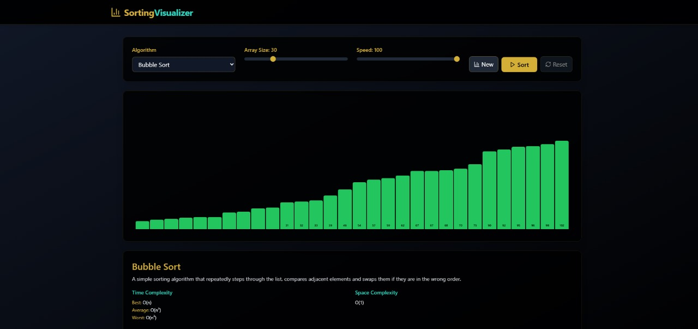

# ⚙️ Sorting Visualizer

An elegant, high-performance **Sorting Visualizer Web Application** built with **React + Vite**, designed to help users understand how various sorting algorithms work through **interactive animations** and **comparisons** — all wrapped in a modern black and golden-yellow UI theme.



---

## 🚀 Features

- 🎯 **Multiple Algorithms Supported**:
  - Bubble Sort
  - Selection Sort
  - Insertion Sort
  - Merge Sort
  - Quick Sort
  - Heap Sort

- 🔧 **User Controls**:
  - Choose sorting algorithm
  - Adjust array size
  - Change animation speed
  - Generate new array
  - Pause, Resume, and Reset

- 📊 **Performance Comparison Table**:
  - Time complexity (Best, Average, Worst)
  - Space complexity
  - Stability and use cases

- 🎨 **Modern UI**:
  - Clean black and golden-yellow theme
  - Smooth animations
  - Responsive and mobile-friendly layout

---

## 📸 Screenshots

| Desktop View | Mobile View |
|--------------|-------------|
|  |  |

---

## 🛠️ Built With

- ⚛️ React
- ⚡ Vite
- 🎨 Tailwind CSS
- 💡 Framer Motion
- 📚 react-syntax-highlighter

---
## 🚀 Live Demo

Check out the live app 👉 [https://your-app.vercel.app](https://your-app.vercel.app)

---

## 🧑‍💻 Author

Designed and developed with ❤️ by **Dhiraj Sah**

- 🌐 [Portfolio](https://www.dhirajsah99.com.np)
- 📧 eyemdheeraj436@gmail.com
- 💼 [LinkedIn](https://www.linkedin.com/in/dhiraj-sah-7a3522220/)
- 🐙 [GitHub](https://github.com/DhirajSah736)

## 🧪 Getting Started

### 🔧 Installation

```bash
git clone https://github.com/DhirajSah736/Sorting-Visualizer.git
cd sorting-visualizer
npm install
npm run dev